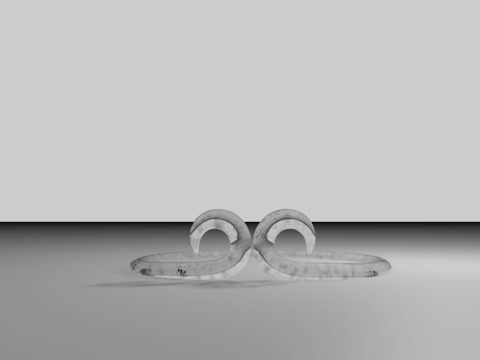

**项目名：卡哇伊的万圣节icon**

日期：0820

[原作地址](https://design.tutsplus.com/tutorials/how-to-create-kawaii-halloween-icons-in-adobe-illustrator--cms-27307?_ga=2.21134523.10950460.1503120405-500533575.1502885392)

收获：

- 蝙蝠的翅膀原来是这样画的

  

- 分割的应用

- 喵=￣ω￣= 这种嘴巴是使用两个半椭圆拼接的

- 膨胀效果的再一次应用

---

**金箍**

C4D的建模部分，渲染好费时间，多做MG动画部分吧

其他：斯德哥尔摩是瑞典首都。。